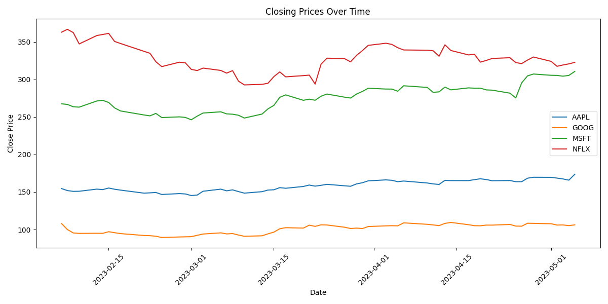
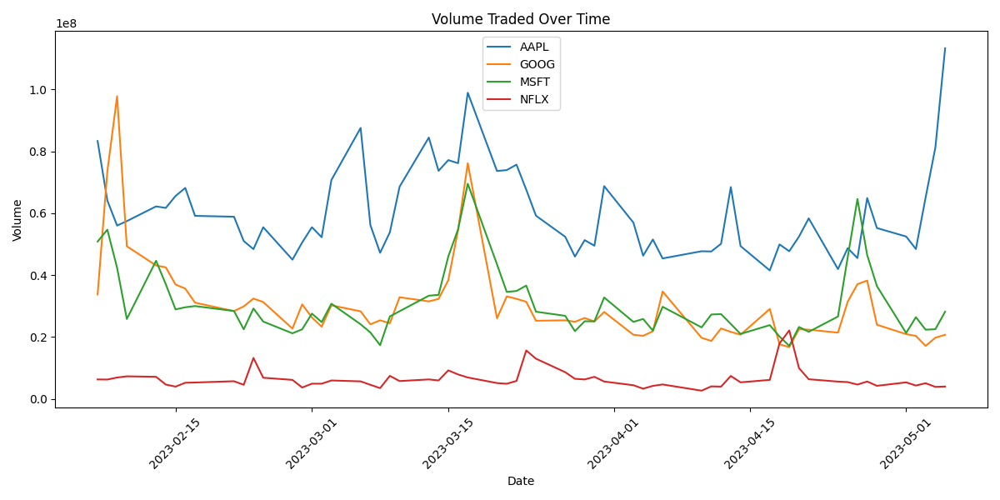
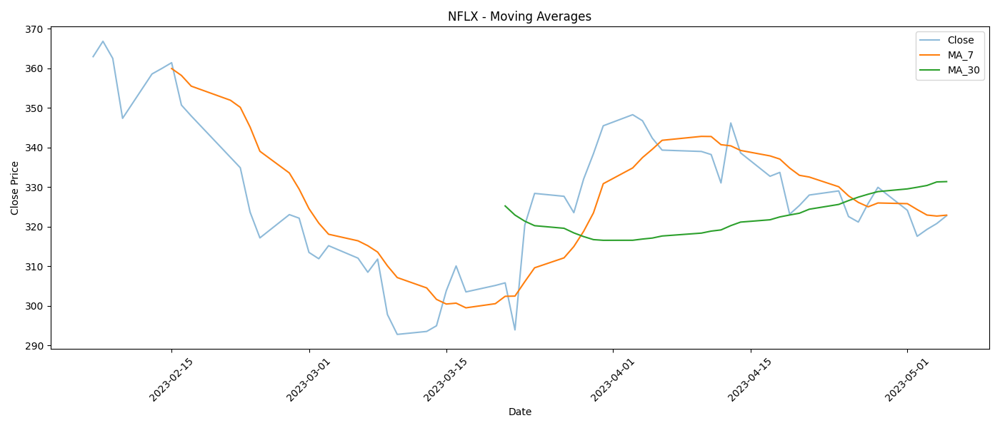
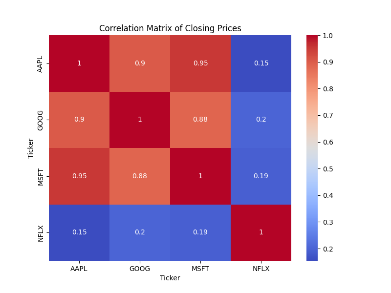
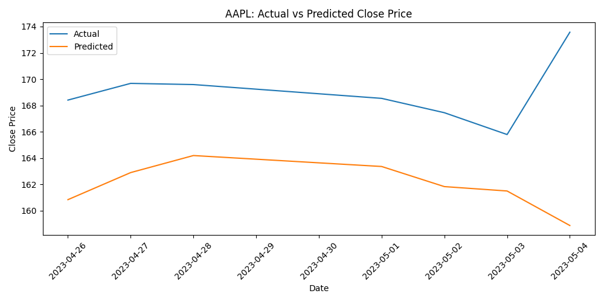

# Stock Market Analysis Project

This project provides a comprehensive pipeline for stock market data analysis, including data preparation, feature engineering, exploratory data analysis (EDA), visualization, and predictive modeling.

## Project Structure

- `main.py`: Main script to run the analysis pipeline.
- `data_utils.py`: Data loading, cleaning, feature engineering utilities.
- `visualization.py`: Functions for plotting and visualizations.
- `stocks.csv`: Example stock market dataset.
- `images/`: Directory for visualization images (add your generated plots here).

## Features

- Data loading and cleaning
- Feature engineering (rolling averages, volatility, etc.)
- EDA with visualizations (closing prices, volume, moving averages, heatmaps)
- Predictive modeling (linear regression example)

## Setup

1. Clone the repository:
   ```bash
   git clone <your-repo-url>
   cd stock-market
   ```
2. Install dependencies:
   ```bash
   pip install -r requirements.txt
   ```
3. Add your `stocks.csv` data file to the project root.

## Usage

Run the main analysis script:
```bash
python main.py
```

## Example Visualizations

Below are example images generated by the analysis pipeline. Replace these with your own outputs in the `images/` directory.

### Closing Prices


### Volume


### Moving Averages & Volatility


### Correlation Heatmap


### Actual vs Predicted (AAPL)


## Notes
- You can expand the predictive modeling section for other tickers or more advanced models.
- For best results, use a well-formatted and up-to-date `stocks.csv` file.

## License
MIT License 